# Fashnix - What-to-Wear AI

<p align="center">
  
</p>

<p align="center">
  <strong>An Android wardrobe intelligence app that combines outfit planning, AI styling, closet analytics, image scanning, and Firebase-backed personalization.</strong>
</p>

<p align="center">
  
  
  
</p>

## Overview

Fashnix is a mobile AI fashion assistant built for people who want quick, practical outfit decisions from their own wardrobe. The app helps users create a style profile, scan clothing items, save wardrobe pieces, receive outfit ideas, chat with an AI stylist, plan looks for events, and manage closet activity from one polished Android experience.

The project is structured as a production-style Android app with Firebase Authentication, Firestore, Storage, Cloud Messaging, Cloud Functions, local TensorFlow Lite model assets, and a dedicated model-training notebook package.

## Core Features

- Authentication flow with login, create account, responsive layouts, and branded onboarding.
- Personal style profile with avatar upload, wardrobe sync status, badges, activity history, and account actions.
- Wardrobe gallery for clothing items, item detail screens, metadata, categories, colors, occasions, and ownership tracking.
- AI clothing scan using local model assets and camera-based item capture.
- AI stylist chat powered through Firebase Cloud Functions and OpenAI server-side secrets.
- Daily outfit studio with suggested looks, weather-aware inspiration, and saved wardrobe context.
- Intelligence Hub with remix generator, gap analyzer, event advisor, wardrobe analytics, capsule tools, cost-per-wear, and style challenges.
- Planner, laundry reminders, family closet flows, notifications, and profile personalization.

## Product Screens

<p align="center">
  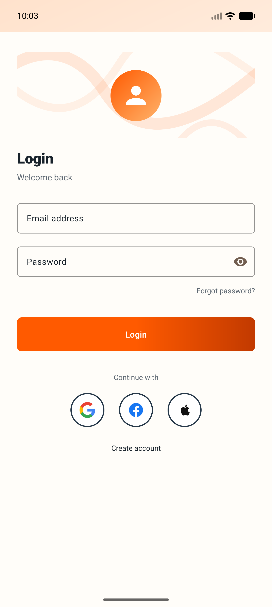
  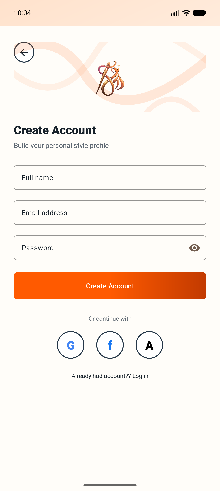
</p>

<p align="center">
  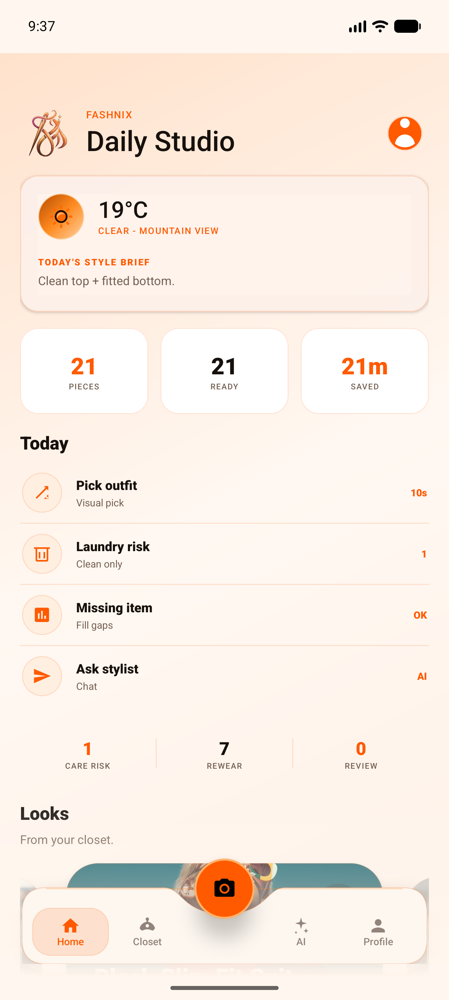
  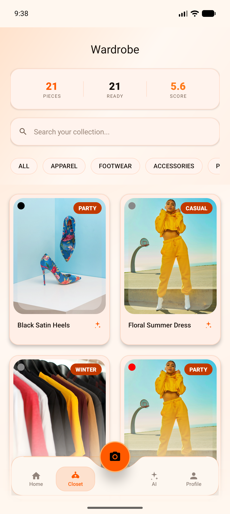
  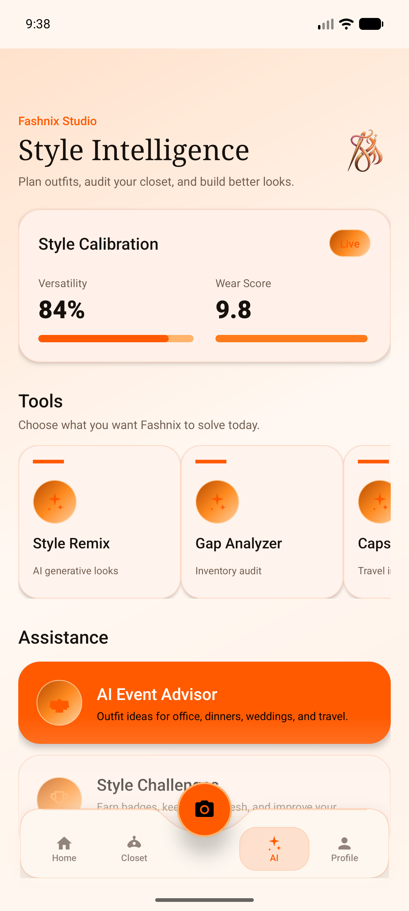
</p>

<p align="center">
  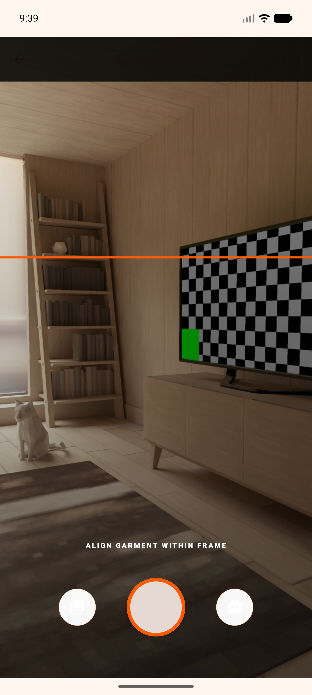
  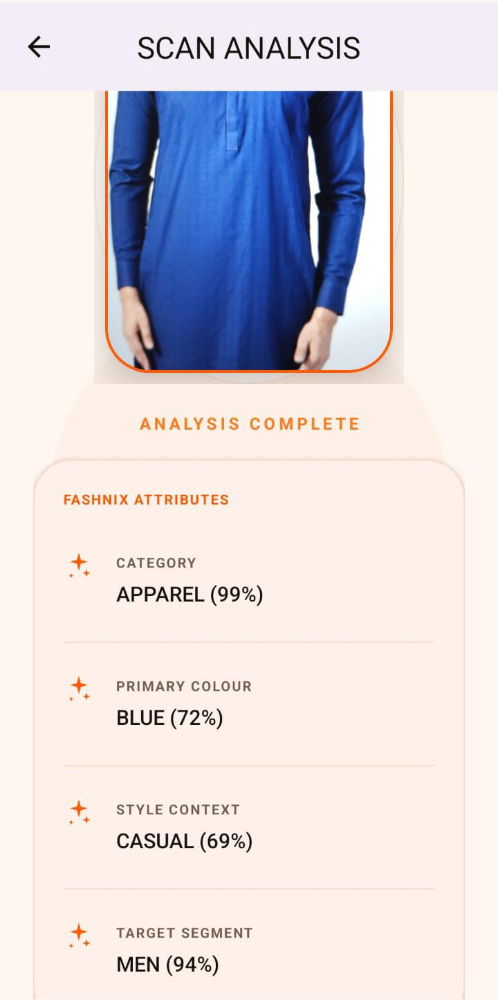
  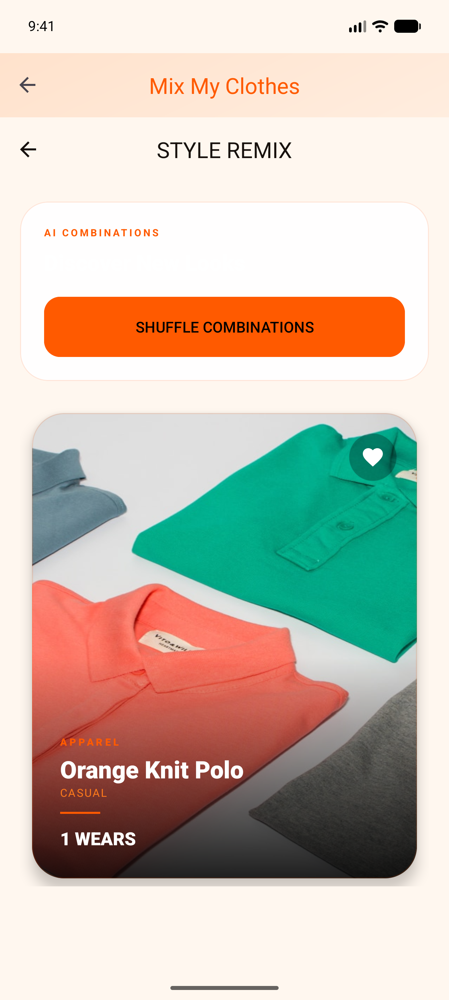
</p>

<p align="center">
  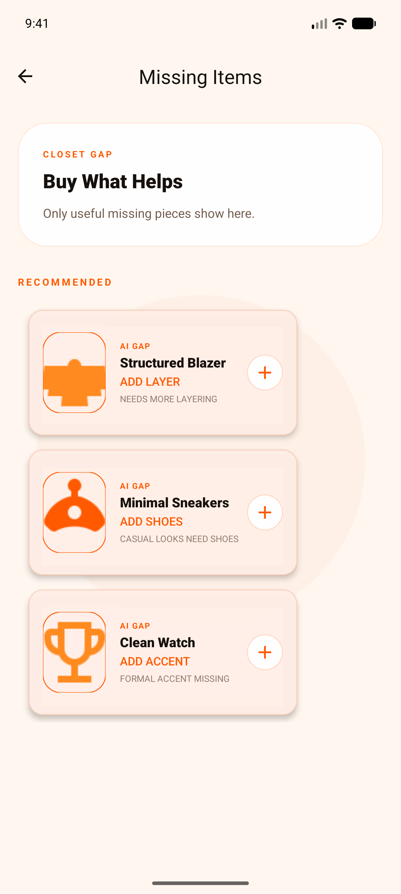
  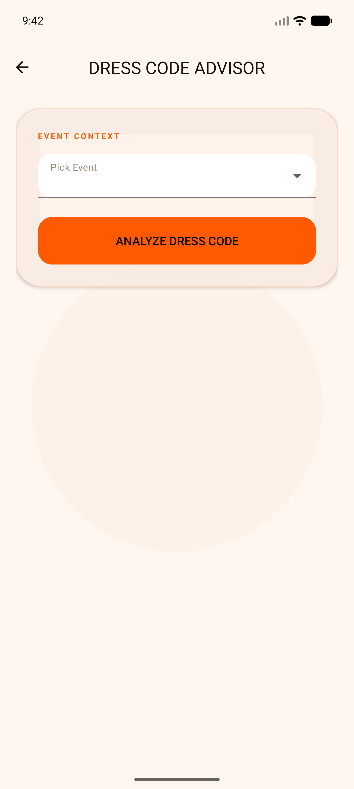
  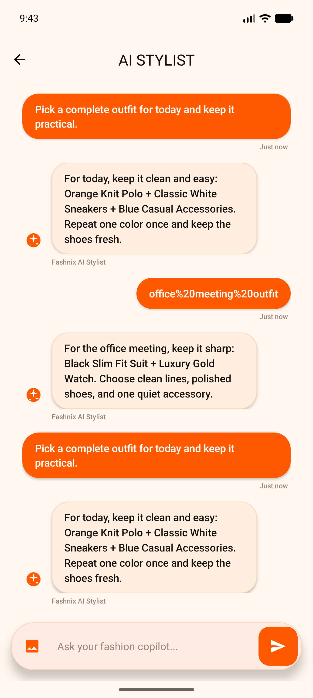
</p>

<p align="center">
  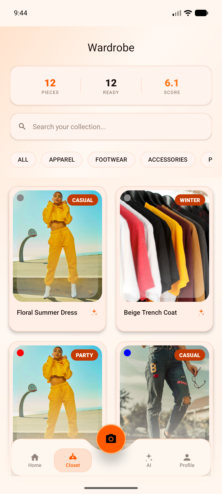
  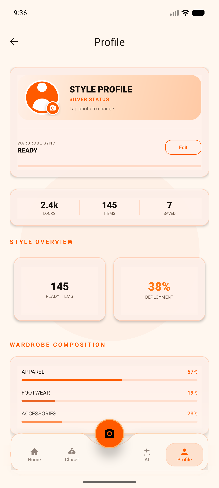
  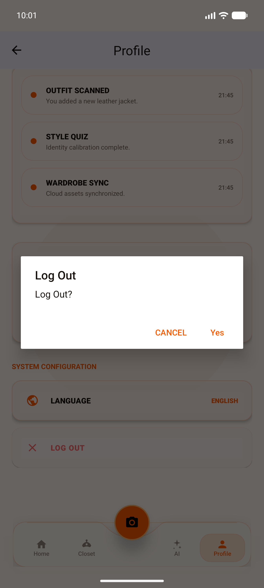
</p>

## Architecture

```text
Fashnix
|-- app/
|   |-- src/main/java/com/fashnix/app/
|   |   |-- data/          # repositories, Firebase access, local models
|   |   |-- di/            # Hilt dependency injection modules
|   |   |-- service/       # messaging and background services
|   |   |-- ui/            # feature screens and view models
|   |   |-- workers/       # scheduled reminders
|   |-- src/main/assets/   # TFLite/Keras assets, labels, training charts
|   |-- src/main/res/      # layouts, drawables, navigation, menus, strings
|-- functions/             # Firebase Cloud Functions for AI chat and notifications
|-- model-training/        # training notebook and exported outputs
|-- docs/screenshots/      # HD app marketing screenshots
|-- firestore.rules        # Firestore security rules
|-- storage.rules          # Firebase Storage security rules
|-- firebase.json          # Firebase project configuration
```

## Tech Stack

- Kotlin, AndroidX, Material Components, ConstraintLayout, ViewBinding
- Firebase Auth, Firestore, Storage, Functions, Messaging, Crashlytics
- Hilt dependency injection
- CameraX for image capture
- TensorFlow Lite and MediaPipe vision dependencies
- Glide for image loading
- WorkManager for reminders
- Node.js Firebase Functions with OpenAI server-side integration

## AI and Model Assets

The app includes on-device model assets in `app/src/main/assets/`, including TensorFlow Lite files, Keras training checkpoints, label maps, training curves, and model evaluation images. The training notebook and exported outputs are kept in `model-training/` so reviewers can inspect the AI development workflow separately from the Android runtime code.

## Deep Learning Model

Fashnix uses a **MobileNetV2-based multi-task deep learning model** for fashion image understanding. The model was trained to classify multiple clothing attributes from a single product image:

- **Category:** Accessories, Apparel, Footwear, Personal Care
- **Colour:** Black, White, Blue, Red, Other
- **Occasion:** Casual, Ethnic, Formal, Party, Smart Casual, Sports, Travel
- **Gender:** Boys, Girls, Men, Unisex, Women

The training pipeline uses **transfer learning** with a MobileNetV2 backbone pre-trained on ImageNet, followed by custom classification heads for each output task. After training and fine-tuning, the model was converted to **TensorFlow Lite** with float16 quantization for Android deployment.

## Dataset and Training

The model training notebook uses the Fashion Product Images dataset and includes data cleaning, preprocessing, class balancing, model training, fine-tuning, evaluation, and TensorFlow Lite export.

| Item | Value |
|------|-------|
| Original metadata rows | 44,424 |
| Rows after required-label cleaning | 44,100 |
| Final usable samples after image and label filtering | 43,216 |
| Training samples | 30,249 |
| Validation samples | 6,484 |
| Test samples | 6,483 |
| Base architecture | MobileNetV2 |
| Training strategy | Transfer learning + fine-tuning |
| Deployment format | TensorFlow Lite |
| TFLite model size | Around 6.4 MB |

## Model Results

The strongest result was achieved on the clothing category task, where the model reached about **96% test accuracy**. Occasion and gender predictions were also usable for app-level recommendations, while colour prediction remained the most difficult task due to noisy dataset labels.

| Task | Test Accuracy | Notes |
|------|---------------|-------|
| Category | ~96% | Strongest task; robust across all four major classes |
| Occasion | ~84% | Useful for event and outfit-planning features |
| Gender | ~81% | Supports user and wardrobe context |
| Colour | ~56% | Hardest task due to inconsistent colour labels |

Category classification report highlights:

| Category | Precision | Recall | F1-score |
|----------|-----------|--------|----------|
| Accessories | 91.30% | 93.72% | 92.49% |
| Apparel | 97.45% | 96.65% | 97.05% |
| Footwear | 99.41% | 98.84% | 99.12% |
| Personal Care | 92.26% | 89.66% | 90.94% |
| Overall category accuracy |  |  | 96.04% |

## Colour Recognition Strategy

Colour prediction was intentionally simplified into five labels: **Black, White, Blue, Red, and Other**. The original dataset contains many noisy colour labels, including single-colour labels for multi-colour products and inconsistent naming across similar shades.

Instead of forcing the model to predict every colour and risk confident wrong predictions, Fashnix uses the **Other** class as a safer fallback. This makes the app more reliable because users can manually correct uncertain colours, and those corrections can later be used to improve the model.

## Key Learning Outcomes

This project connected several parts of a real AI product workflow:

- Preparing and cleaning a computer vision dataset
- Training a multi-output deep learning model
- Using transfer learning and fine-tuning
- Evaluating model accuracy with test data and confusion matrices
- Converting a trained model to TensorFlow Lite
- Integrating AI inference into an Android app
- Connecting mobile UI, Firebase backend, and AI features into one complete product

## Limitations

- Colour recognition is limited by noisy and inconsistent colour labels in the training dataset.
- Studio-style dataset images do not fully represent real-world lighting, angles, backgrounds, and camera quality.
- Outfit recommendations can become more personalized with more user feedback and usage history.
- Raw training images are not committed to this repository because of size and dataset-distribution considerations.

## Future Work

- Improve colour accuracy using more diverse real-world images and cleaner labels.
- Add a user-feedback loop so corrected predictions can improve future recommendations.
- Make outfit suggestions more personalized using style preferences, body type, weather, and occasion history.
- Expand wardrobe analytics with stronger recommendation logic and trend insights.
- Add automated model evaluation reports for future model versions.

## Getting Started

Read [docs/SETUP.md](docs/SETUP.md) for a complete setup guide.

Short version:

```bash
git clone https://github.com/waqi786/fashnix-whattowear-ai.git
cd fashnix-whattowear-ai
./gradlew assembleDebug
```

For Firebase, create `app/google-services.json` from your Firebase Console. A safe template is provided at `app/google-services.json.example`.

## Security Notes

This public repository intentionally excludes private release signing files, local machine configuration, real Firebase Android config, generated build folders, dependency folders, and runtime logs. Firebase/OpenAI secrets should be configured through Firebase secret manager or local environment configuration.

## Repository Highlights

- Recruiter-friendly Android source structure.
- Real app screenshots captured at HD resolution.
- AI model artifacts and training notebook included.
- Firebase backend code and security rules included.
- Sensitive private files excluded through `.gitignore`.

## Author

Built by Waqar Ali as a full-stack Android, Firebase, and AI fashion assistant project.
